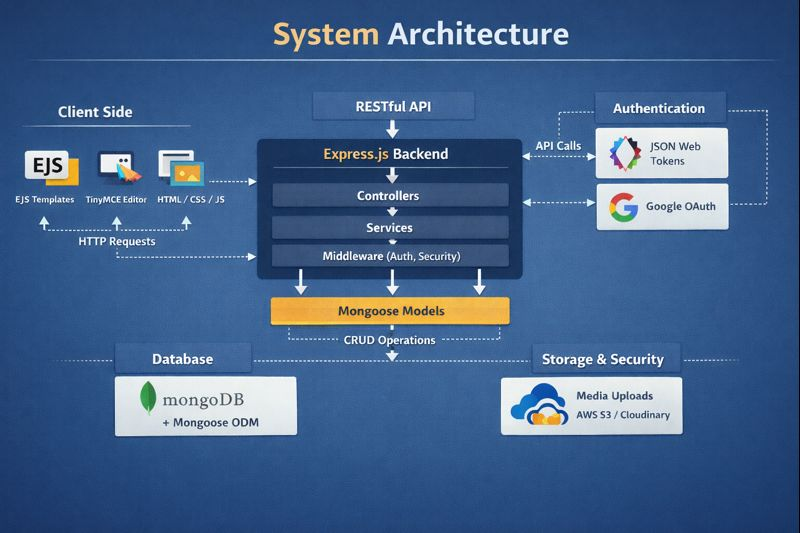
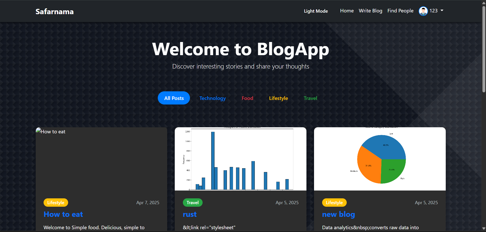
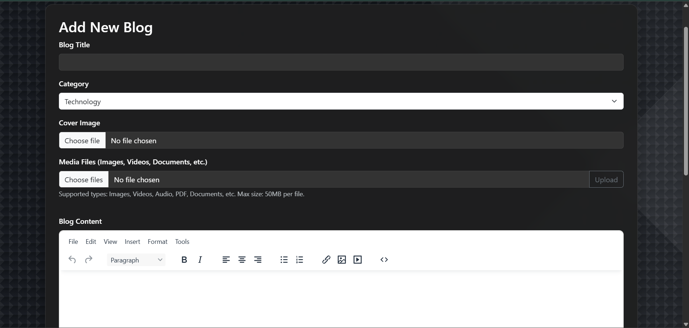
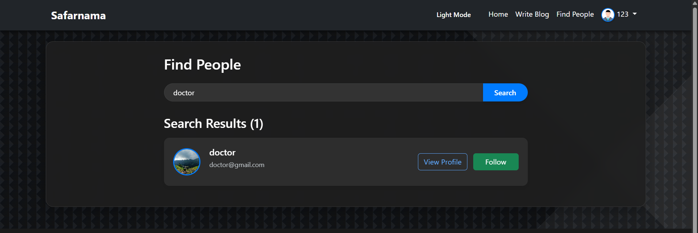
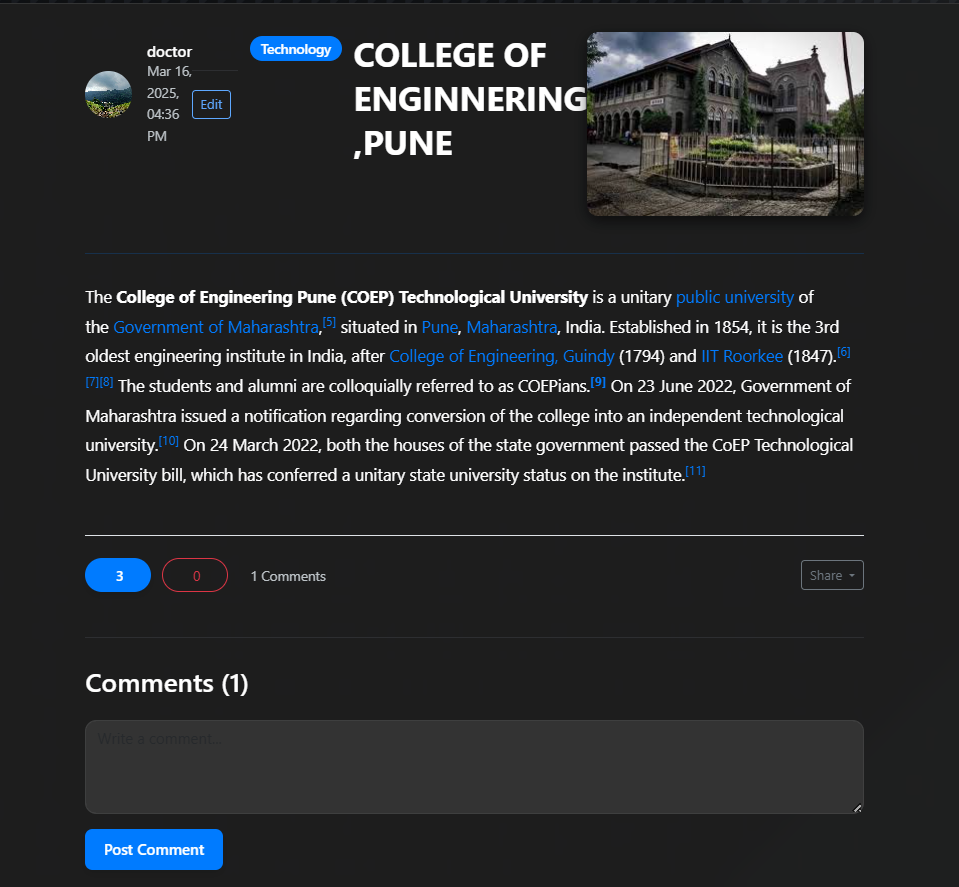
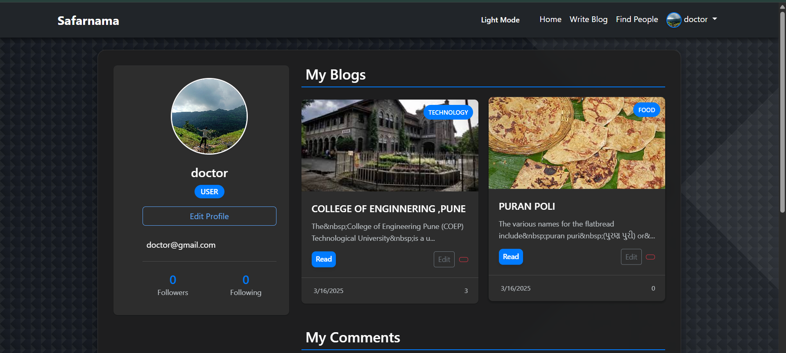

# Safarnama — Full-Stack Social Blogging Platform

Safarnama is a **production-oriented, full-stack blog application** designed to demonstrate real-world web engineering skills.  
It enables users to create rich multimedia blogs, interact socially with other writers, and authenticate securely using modern authentication standards.

This project showcases **end-to-end system design**, **secure authentication**, **media handling**, and **scalable backend architecture** using industry-relevant technologies.

---

## 🔍 Why This Project Matters (For Recruiters)

- ✔ Real-world problem (content creation & social interaction)
- ✔ Full-stack ownership (frontend, backend, database, authentication)
- ✔ Secure authentication (JWT + Google OAuth)
- ✔ Media handling (images, video, audio)
- ✔ Clean MVC architecture
- ✔ Production-ready folder structure
- ✔ Deployable and extensible

**This is not a tutorial project — it is a practical, extensible system.**

---

## 🚀 Core Features

### 📝 Rich Blogging System
- Create and publish blogs using a **WYSIWYG editor**
- Upload cover images
- Attach images, videos, and audio files
- Category-based blog organization

### 👥 Social Platform Capabilities
- Follow / unfollow bloggers
- Like and dislike posts
- Comment on blogs
- View author profiles and activity

### 🔐 Authentication & Security
- JWT-based authentication
- Google OAuth 2.0 integration
- Secure route protection via middleware
- Role-based access handling

### 🎯 User Experience
- Dark / Light mode support
- Responsive, modern UI
- User dashboard with activity overview
- Profile editing and account management

---

## 🛠️ Technology Stack

### Frontend
- EJS (Server-Side Rendering)
- HTML5
- CSS3
- Vanilla JavaScript
- TinyMCE Rich Text Editor

### Backend
- Node.js
- Express.js
- RESTful API architecture

### Database
- MongoDB
- Mongoose ODM

### Authentication & Security
- JWT (JSON Web Tokens)
- Google OAuth (Passport.js)
- Environment-based configuration

---

## 🧱 Architecture Overview

- MVC-based backend design
- Middleware-driven authentication & authorization
- Modular service layer for scalability
- Clear separation of concerns
### System Overview



---

## 📂 Project Structure
```text
Safarnama/
├── config/           # DB, OAuth, JWT configuration
├── controllers/      # Request handling logic
├── middlewares/      # Authentication & error middleware
├── models/           # Mongoose schemas
├── routes/           # API & view routes
├── services/         # Business logic layer
├── public/           # Static assets (CSS, images, JS)
├── views/            # EJS templates
├── .env              # Environment variables
├── index.js          # Application entry point
├── package.json      # Dependencies & scripts
└── README.md         # Project documentation

```


---

## 📸 Application Screens

### Home Page


---

### Add New Blog (Rich Media Editor)


---

### Find People / Bloggers


---

### Blog Feed & Interaction


---

### User Profile & Dashboard



---

## ⚙️ Local Setup

### Prerequisites
- Node.js (v14 or higher)
- MongoDB (local or MongoDB Atlas)
- npm

### Installation

```bash
git clone https://github.com/Shriharipise18/Safarnama.git
cd Safarnama
npm install
Environment Variables

Create a .env file in the root directory:

PORT=3000
MONGO_URI=your_mongodb_uri
JWT_SECRET=your_jwt_secret
GOOGLE_CLIENT_ID=your_google_client_id
GOOGLE_CLIENT_SECRET=your_google_client_secret

Run the Application
npm start
```
## 🧪 Engineering Highlights

- Implemented JWT-based stateless authentication
- Integrated Google OAuth for real-world SSO
- Designed media upload pipelines for images, video, and audio
- Used MongoDB schema relationships for social features
- Implemented secure middleware chains
- Built with scalability in mind

---

## 👨‍💻 About the Developer

**Shrihari Pise**  
Full-Stack Developer (Node.js | MongoDB | Express)

GitHub:  
https://github.com/Shriharipise18

This project reflects hands-on experience in building **production-grade web applications**.

---

## ▶️ Running the Application Locally

After starting the server, visit:

http://localhost:3000


