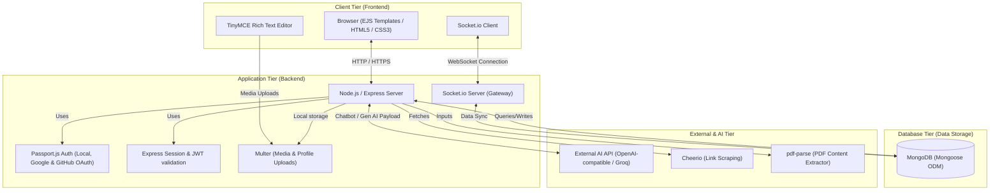

# 🌍 Safarnama: Your Ultimate Travel Companion

Safarnama is a feature-rich, community-driven travel blogging platform designed to empower travelers. Whether you're documenting your own journeys or looking for inspiration, Safarnama provides the tools to create, share, and connect in a modern, AI-enhanced environment.

---

## 🏗️ System Architecture

Safarnama is built using a **Three-Tier Architecture** coupled with an event-driven **Real-Time Gateway** and an **AI Service Integration Layer**.

### High-Level Architecture Diagram


```mermaid
graph TD
    %% Clients
    subgraph "Client Tier (Frontend)"
        Client["Browser (EJS Templates / HTML5 / CSS3)"]
        SIOClient["Socket.io Client"]
        Editor["TinyMCE Rich Text Editor"]
    end

    %% Web Application Gateway / Server
    subgraph "Application Tier (Backend)"
        Server["Node.js / Express Server"]
        Auth["Passport.js Auth (Local, Google & GitHub OAuth)"]
        Session["Express Session & JWT validation"]
        Uploader["Multer (Media & Profile Uploads)"]
        SIOServer["Socket.io Server (Gateway)"]
    end

    %% Databases
    subgraph "Database Tier (Data Storage)"
        DB[("MongoDB (Mongoose ODM)")]
    end

    %% External services
    subgraph "External & AI Tier"
        AIAPI["External AI API (OpenAI-compatible / Groq)"]
        Scraper["Cheerio (Link Scraping)"]
        PDF["pdf-parse (PDF Content Extractor)"]
    end

    %% Relationships
    Client <-->|HTTP / HTTPS| Server
    SIOClient <-->|WebSocket Connection| SIOServer
    Editor -->|Media Uploads| Uploader
    Server -->|Uses| Auth
    Server -->|Uses| Session
    Server -->|Local storage| Uploader
    SIOServer <-->|Data Sync| DB
    Server <-->|Queries/Writes| DB
    Server -->|Inputs| PDF
    Server -->|Fetches| Scraper
    Server <-->|Chatbot / Gen AI Payload| AIAPI
```

---

### Core Architectural Components

#### 1. Presentation Layer (Frontend Client)
*   **EJS (Embedded JavaScript Templates)**: Server-side rendering engine used to deliver dynamic HTML structures to the client.
*   **Vanilla CSS**: Custom, modern layout styling without heavy framework overhead.
*   **TinyMCE Editor**: Rich text editor integrated into the blog creation interface to allow inline uploads and clean formatting of travel blogs.
*   **Socket.io Client**: Manages full-duplex WebSocket connections back to the server for instant chat delivery.

#### 2. Controller & Logic Layer (Express Server)
*   **Express Router**: Segmented routers to isolate modules:
    *   `routes/user.js`: Handles registration, sign-in, and auth redirects.
    *   `routes/blog.js`: Handles blog creation, updating, liking, commenting, and AI generation hooks.
    *   `routes/profile.js` & `routes/social.js`: Custom user dashboards, searching travelers, and following/unfollowing systems.
    *   `routes/chat.js` & `routes/bot.js`: Fetching P2P messages and executing chat calls to the travel bot.
*   **Authentication & Session Pipeline**:
    *   Uses **Passport.js** to handle third-party OAuth authentication strategies (Google & GitHub).
    *   Uses a **JWT authentication middleware** (`checkForAuthenticationCookie`) to read authorization tokens from cookies, verify credentials, and populate user sessions.
*   **Multer Middleware**: Configured to parse multipart form-data, permitting image uploads for blog covers, profile avatars, and inline multimedia contents.

#### 3. Real-Time Communication Gateway (`gateway/socket.js`)
*   **Token-Verified Socket Handshake**: Authenticates socket connections by reading cookies and verifying JWT signatures before establishing a connection.
*   **Online Presence Tracker**: Maintains an in-memory `Map` binding active `userId` values to `socketId` connections, enabling global online status notifications (`user_status` events).
*   **Isolated Rooms**: Establishes discrete room segments based on MongoDB `Conversation` IDs to isolate private conversations.

#### 4. AI & Content Scraper Layer
*   **Cheerio & Fetch**: Allows blogs to be generated from a URL by retrieving the HTML body, removing scripts/styles/navigation tags, and extracting the core textual context.
*   **pdf-parse**: Reads raw travel documents/brochures directly from local file buffers to supply high-density source context to the generative models.
*   **OpenAI-Compatible Client**: Queries external LLMs (e.g., Groq) with structured system prompts for both blog drafts and direct travel assistant conversations.

#### 5. Data Store Layer (Mongoose Schemas)
*   **User Schema**: Encodes user profiles, password salts (via HMAC SHA256 hashing pre-save hooks), followers, and OAuth tokens.
*   **Blog Schema**: Encodes blog titles, HTML bodies, cover images, likes, dislikes, categories, and reference linkages.
*   **Comment Schema**: Tracks multi-user engagement linked to individual blogs.
*   **Conversation & Message Schemas**: Models chat history and metadata between platform users.

---

## 🔄 Core Data Flows

### A. Authentication Flow
```text
[User Client] -> (Enters Credentials / OAuth Click)
      |
      v
[Express Route] -> (Verifies Password Salt OR Resolves OAuth Callback)
      |
      v
[Auth Service] -> (Generates JWT signed with JWT_SECRET)
      |
      v
[Express Response] -> (Writes JWT to cookie "token") -> Redirects to Home Page
```

### B. AI-Powered Blog Generation Flow
```text
[User Client] -> (Inputs Topic, Scrape Link, OR Uploads PDF)
      |
      v
[Express Route] -> (Resolves Input Type)
      |
      +---> [Topic]: Read raw string
      +---> [Link]: HTTP Fetch -> Cheerio Scraper -> Clean Text
      +---> [PDF]: Multer Upload -> pdf-parse Extract -> Delete File
      |
      v
[Prompt Formatter] -> (Merges Context with Travel Writer System Prompt)
      |
      v
[AI API (Groq/OpenAI)] -> (Generates Structured HTML Document)
      |
      v
[User Client] -> (Populated directly into TinyMCE Editor canvas)
```

---

## 🚀 Key Features

### 🔐 Secure Authentication
- **Multi-method Login**: Sign up or log in using local email/password or seamless OAuth integration with **Google** and **GitHub**.
- **Secure Sessions**: Powered by JWT and Passport.js for a safe browsing experience.

### 🤖 AI-Powered Content Creation
- **Instant Blog Generation**: Use the built-in AI to generate high-quality travel blogs.
  - **From Topics**: Simply provide a keyword or title.
  - **From PDFs**: Upload a travel brochure or document and let the AI extract the essence.
  - **From Links**: Paste a URL to summarize and re-imagine travel articles.
- **Content Editor**: A powerful editor with support for cover images and multimedia attachments.
- **AI Editor Review**: Automatically proofread content, fix grammar, and get styled HTML corrections alongside constructive recommendations.

### 👥 Social & Community Interaction
- **Personalized Profiles**: Showcase your travel stories and manage your content through a custom user dashboard.
- **Social Connect**: Follow your favorite travelers to stay updated on their latest adventures.
- **Engagement Tools**: Express yourself by liking or disliking posts and engaging in real-time discussion via comments.

### 💬 Real-time Communication
- **P2P Chat**: Connect directly with other travelers to share tips, messages, and typing statuses.
- **AI Travel Assistant**: A real-time chatbot (powered by Groq AI) available to answer your travel queries 24/7.

---

## 🛠️ Tech Stack

- **Backend**: Node.js, Express.js
- **Database**: MongoDB (Mongoose ODM)
- **Frontend**: EJS (Embedded JavaScript Templates), Vanilla CSS
- **AI Integration**: Groq / OpenAI-compatible API
- **Real-time**: Socket.io
- **Security**: Helmet, JWT, Cookie-parser
- **File Handling**: Multer

---

## 📂 Project Structure

```text
├── config/             # Passport and configuration files
├── gateway/            # Socket.io connection logic & messaging handlers
├── middlewares/        # Custom Express middlewares (authentication, error handlers)
├── models/             # Mongoose schemas (User, Blog, Comment, Conversation, Message)
├── public/             # Static assets (CSS, JS, Uploads, Images)
├── routes/             # API endpoints and UI rendering routes
├── services/           # Authentication service & token generation
├── views/              # EJS templates for the UI views (home, blog, profiles, chat, search)
├── index.js            # Main server entry point
└── package.json        # Node.js dependencies and scripts
```

---

## ⚙️ Installation & Setup

1. **Clone the repository**:
   ```bash
   git clone https://github.com/Shriharipise18/Safarnama.git
   cd Safarnama
   ```

2. **Install dependencies**:
   ```bash
   npm install
   ```

3. **Environment Variables**:
   Create a `.env` file in the root directory and add the following:
   ```env
   PORT=8000
   MONGO_URL=your_mongodb_connection_string
   JWT_SECRET=your_jwt_secret
   SESSION_SECRET=your_session_secret
   
   # AI Configuration (Groq / OpenAI Compatible API)
   AI_API_KEY=your_ai_api_key
   AI_API_URL=your_ai_endpoint_url
   AI_API_MODEL=your_selected_llm_model
   
   # Passport OAuth Credentials
   GOOGLE_CLIENT_ID=your_google_oauth_id
   GOOGLE_CLIENT_SECRET=your_google_oauth_secret
   GITHUB_CLIENT_ID=your_github_oauth_id
   GITHUB_CLIENT_SECRET=your_github_oauth_secret
   ```

4. **Run the application**:
   ```bash
   # For development
   npm run dev

   # For production
   npm start
   ```

---

## 🔮 Future Enhancements
- **Interactive Maps**: Visualize travel routes directly on the blog.
- **Offline Support**: Draft blogs even without an internet connection.
- **Advanced Social Features**: Shareable travel itineraries and group trips.

---

Made with ❤️ for Travelers.
